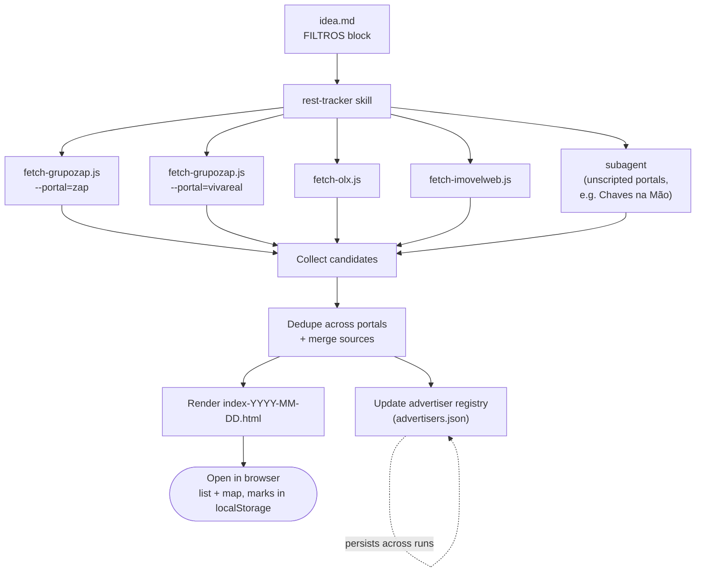

# Real Estate Tracker

Prefere ler o readme em português? [README.pt-BR.md](README.pt-BR.md)

A real-estate search tracker driven by an AI coding agent: describe what you're looking for in plain filters, and the agent searches real estate portals, dedupes listings across them, and renders a single self-contained HTML app to browse and mark the results. Not tied to any one city — clone it, edit the filters, point it wherever you're house-hunting.

Inspired by [this gist](https://gist.github.com/brunobertolini/6c319951db004b8e1d9c4752afc7f6ba).

## Requirements

- [Claude Code](https://claude.com/product/claude-code) — the search workflow is packaged as a Claude Code [Skill](https://docs.claude.com/en/docs/claude-code/skills) (`.claude/skills/rest-tracker/`). That's what's tested; adapting it to another agent tool is possible but not verified here.
- [Node.js](https://nodejs.org/) — runs the portal-fetching scripts.
- `curl` available on your `PATH` — the scripts shell out to it for the actual HTTP requests (see "The skill" below for why).
- A browser to open the generated HTML in. No server, database, or API key needed for any of it.

## What you'll get

Running the tracker produces one HTML file you open directly in a browser — no install, no server. It looks and behaves like a small Airbnb-style listing site:

- **Left:** a scrollable list of cards — one per property, each showing its cover photo, price, address, and quick facts (m², bedrooms, bathrooms, parking), plus a badge when the same property was found on 2+ portals.
- **Right:** a map with a price pin per listing; click a pin or a card to open a detail view with the full description, amenities, a mini-map, and a "view on ZAP / OLX / ..." link for every portal it appeared on.
- Three one-click marks per listing — 🏠 Visit / ⭐ Interested / ✕ Discard — plus free-text notes, saved locally in your browser so re-running the search never loses your decisions.

## How it works

1. Clone this repo and edit the `FILTROS` block in [`idea.md`](idea.md) — objective (rent/buy), property type, city/state/neighborhoods, min bedrooms/area, max total price, exclusions, etc. There's nothing Teresina-specific about the mechanism; it's just what this repo's `idea.md` happens to be set to right now — change the city/state and the same pipeline runs against wherever you point it.
2. Ask Claude Code to "regenerate" or "refresh" the tracker.
3. Get a new `index-YYYY-MM-DD.html` — open it in a browser.

Re-running never overwrites a previous `index-*.html`; each run produces a new timestamped file.

The diagram below is the technical pipeline behind step 2 — useful if you're curious or debugging, not required reading to just use the project.



## Files

| Path | What it is |
|---|---|
| `idea.md` | The filter criteria (`FILTROS` block) and the original search/build spec — this is the file you edit to point the tracker at your own city and preferences |
| `index-YYYY-MM-DD.html` | Generated output — self-contained property browser (list + map). Not committed by default; regenerate as needed |
| `advertisers.json` | Persistent registry of advertisers/imobiliárias seen across runs — name, phone, own website if found. Accumulates over time, unlike listings |
| `.claude/skills/rest-tracker/` | The Claude Code skill that drives regeneration — see below |

## The app (`index-*.html`)

- Airbnb-style layout: listing sidebar + Leaflet/OpenStreetMap map (desktop split, mobile toggle), light/dark theme
- Each listing shows all portals it was found on, with links to every source
- Mark listings **🏠 Visitar / ⭐ Intenção / ✕ Descartar**, with notes — saved to `localStorage` keyed by listing ID, so regenerating the data doesn't wipe your marks
- Top filters: unmarked (inbox, default), Intenção, Visitar, Descartados, Todos
- Cover images are always generated locally (SVG) as a fallback; real portal photos are attempted on top and fall back cleanly if blocked
- Map pins use the portal's own listing coordinates when available (ZAP/Viva Real/OLX all provide these); only fall back to an approximate neighborhood centroid when a source doesn't supply coordinates — labeled honestly either way

**Caveat:** marks are scoped to the browser's `file://` origin. Chrome shares one origin across local files, so marks usually carry over to a new timestamped file automatically; Firefox scopes by file path and won't carry them over.

## The skill (`.claude/skills/rest-tracker/`)

- [`SKILL.md`](.claude/skills/rest-tracker/SKILL.md) — the regeneration workflow: read filters → search portals → dedupe → update advertiser registry → render → report
- [`REFERENCE.md`](.claude/skills/rest-tracker/REFERENCE.md) — listing field schema, dedupe rule, advertiser registry schema, and the portal-scraping recipes
- `scripts/` — deterministic Node fetchers for ZAP Imóveis, Viva Real, OLX, and ImovelWeb (no LLM tokens spent scraping HTML; portals without a script yet fall back to an agentic search). Each shells out to `curl` rather than Node's own `fetch()`, since these portals block Node's fetch fingerprint but not curl's.

Portals currently covered: ZAP Imóveis, Viva Real, OLX, ImovelWeb (all scripted), Chaves na Mão (agentic, no script yet).

You don't need the agent to try the scripts — they're plain CLI tools you can run yourself:

```
node .claude/skills/rest-tracker/scripts/fetch-olx.js \
  --neighborhoods="Renascença,Itararé" --uf=pi --city=teresina \
  --min-bedrooms=2 --min-area=50 --max-total=1300
```

Prints progress to stderr and a JSON array of matching listings to stdout. All four scripts follow the same `--neighborhoods/--min-bedrooms/--min-area/--max-total` pattern — see [REFERENCE.md](.claude/skills/rest-tracker/REFERENCE.md) for the full flag list and output schema per portal.

## Honesty rules

Never invented: listings, prices, or coordinates. Anything estimated (condo fee, location accuracy) is labeled as such rather than presented as confirmed. If a portal blocks access, that's reported rather than silently skipped.

## License

[MIT](LICENSE) — use it, fork it, adapt it to your own city.
