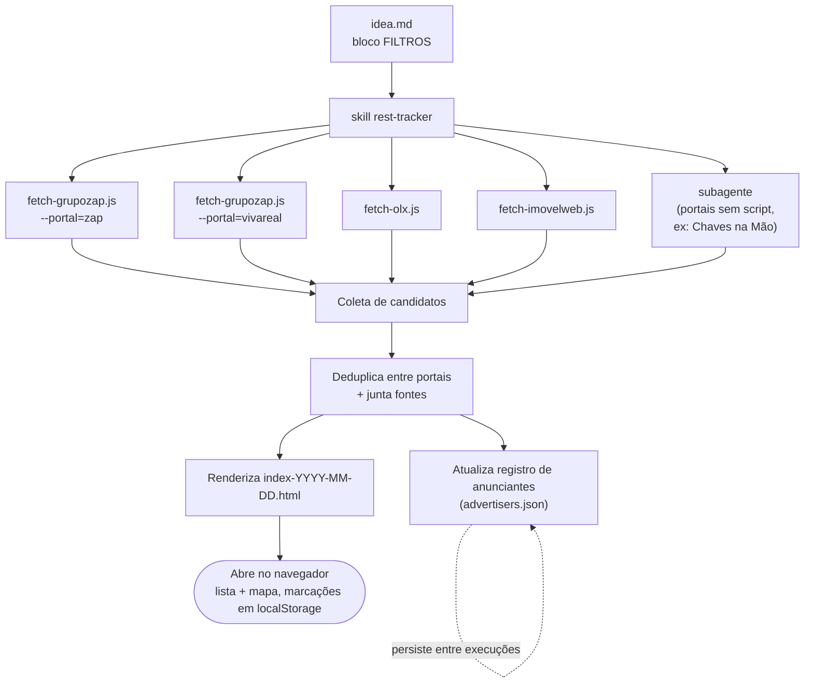

# Rest Tracker

Prefer reading in English? [README.md](README.md)

Um rastreador de busca de imóveis conduzido por um agente de IA para programação: descreva o que você procura em filtros simples, e o agente busca em portais imobiliários, remove duplicatas entre eles e gera um único app HTML autossuficiente para navegar e marcar os resultados. Não é preso a nenhuma cidade específica — clone o repositório, edite os filtros e aponte para onde você estiver procurando imóvel.

Inspirado por [este gist](https://gist.github.com/brunobertolini/6c319951db004b8e1d9c4752afc7f6ba).

## Como funciona

1. Clone este repositório e edite o bloco `FILTROS` em [`idea.md`](idea.md) — objetivo (alugar/comprar), tipo de imóvel, cidade/estado/bairros, quartos/área mínimos, valor total máximo, exclusões etc. Não há nada específico de Teresina no mecanismo em si; é só o que o `idea.md` deste repositório está configurado agora — mude a cidade/estado e o mesmo pipeline roda para onde você quiser.
2. Peça ao seu agente de programação (este projeto foi construído com o Claude Code) para "regenerar" / "atualizar" o rastreador — isso aciona a skill `rest-tracker` em `.claude/skills/`.
3. Você recebe um novo `index-YYYY-MM-DD.html` — abra no navegador, sem precisar de servidor.

Rodar de novo nunca sobrescreve um `index-*.html` anterior; cada execução gera um novo arquivo com data.

## Arquivos

| Caminho | O que é |
|---|---|
| `idea.md` | Os critérios de filtro (bloco `FILTROS`) e a especificação original de busca/construção — é este arquivo que você edita para apontar o rastreador para sua própria cidade e preferências |
| `index-YYYY-MM-DD.html` | Saída gerada — navegador de imóveis autossuficiente (lista + mapa). Não é versionado por padrão; regenere quando precisar |
| `advertisers.json` | Registro persistente de anunciantes/imobiliárias vistos entre execuções — nome, telefone, site próprio se encontrado. Acumula ao longo do tempo, diferente das listagens |
| `.claude/skills/rest-tracker/` | A skill do Claude Code que conduz a regeneração — veja abaixo |

## O app (`index-*.html`)

- Layout estilo Airbnb: barra lateral com a lista + mapa Leaflet/OpenStreetMap (split no desktop, alternância no celular), tema claro/escuro
- Cada imóvel mostra todos os portais em que foi encontrado, com links para cada fonte
- Marque imóveis como **🏠 Visitar / ⭐ Intenção / ✕ Descartar**, com anotações — salvo no `localStorage` pela ID do imóvel, então regenerar os dados não apaga suas marcações
- Filtros no topo: sem marca (caixa de entrada, padrão), Intenção, Visitar, Descartados, Todos
- Capas são sempre geradas localmente (SVG) como alternativa; fotos reais dos portais são tentadas por cima e caem de volta para a capa gerada se bloquearem
- Os pinos do mapa usam as coordenadas do próprio anúncio quando disponíveis (ZAP/Viva Real/OLX fornecem todas); só recorre ao centroide aproximado do bairro quando uma fonte não fornece coordenadas — rotulado honestamente em ambos os casos

**Ressalva:** as marcações ficam vinculadas à origem `file://` do navegador. O Chrome compartilha uma única origem entre arquivos locais, então as marcações costumam persistir automaticamente no novo arquivo com data; o Firefox vincula por caminho de arquivo e não vai levá-las adiante.

## A skill (`.claude/skills/rest-tracker/`)

- `SKILL.md` — o fluxo de regeneração: ler filtros → buscar nos portais → deduplicar → atualizar registro de anunciantes → renderizar → reportar
- `REFERENCE.md` — schema dos campos de cada imóvel, regra de deduplicação, schema do registro de anunciantes e as receitas de extração de cada portal
- `scripts/` — buscadores determinísticos em Node para ZAP Imóveis, Viva Real, OLX e ImovelWeb (nenhum token de LLM gasto lendo HTML; portais sem script ainda caem para uma busca feita por um agente). Cada um chama o `curl` em vez do `fetch()` nativo do Node, já que esses portais bloqueiam a "impressão digital" do fetch do Node, mas não a do curl.

Portais cobertos atualmente: ZAP Imóveis, Viva Real, OLX, ImovelWeb (todos com script), Chaves na Mão (via agente, ainda sem script).

## Regras de honestidade

Nunca inventados: imóveis, preços ou coordenadas. Tudo que é estimado (condomínio, precisão da localização) é rotulado como tal em vez de apresentado como confirmado. Se um portal bloquear o acesso, isso é reportado em vez de silenciosamente ignorado.
